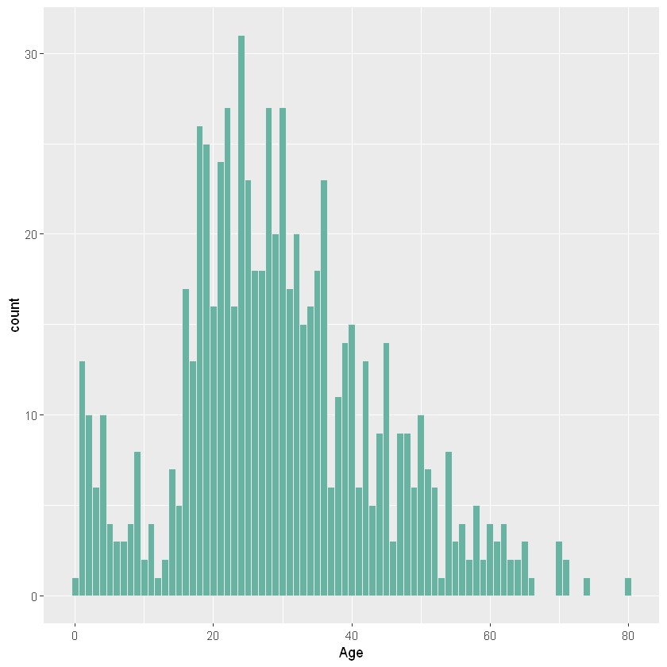
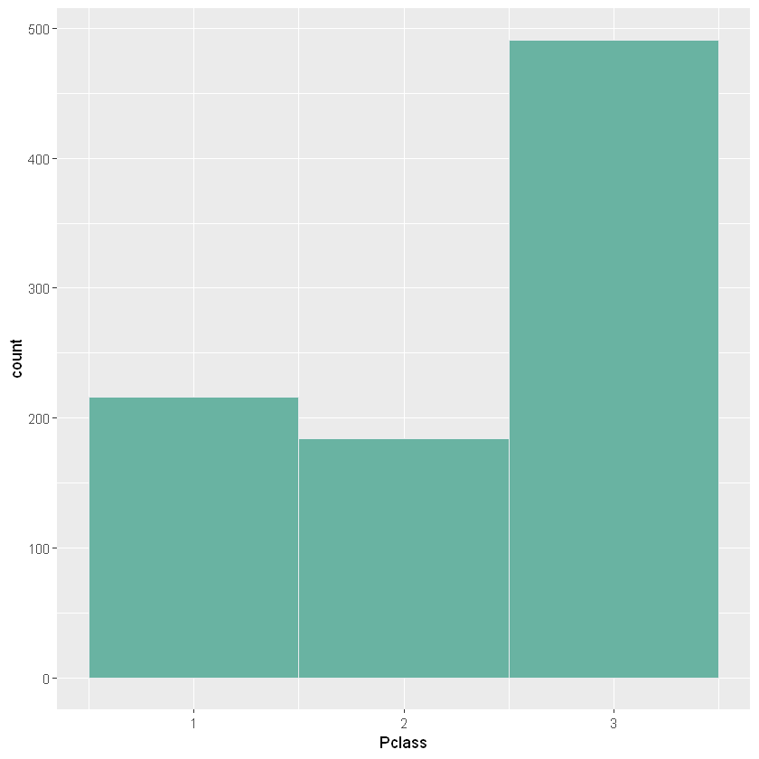

# Titanic-data-analysis-and-classification

This repository is my submission for the **kaggle competition** : "*Titanic: Machine Learning from Disaster*"

The goal was to predict the survival of 1300 passagers only by using the remaining 800.

## Details and accuracy result

I used a very basic model as a test which gave an overall result of 87%.
You can easily change it, but don't forget to specify the input size.

## Statistics

This submission was a good introduction to the **pyplot** library and the R language. Here are some of the charts that you can find in this repository :

### Gender distribution

### Gender survival

### Class survival

## graph generated in R language :

### Age distribution

### Class distribution

## License

This project is licensed under the MIT License - see the [LICENSE.md](LICENSE.md) file for details

## Acknowledgments

* Any advice or critics are welcome !
* I used the python best practice
* A huge thanks to the channel [Socratia](https://www.youtube.com/channel/UCW6TXMZ5Pq6yL6_k5NZ2e0Q), the python educational video really helped me sharpen my python skills.
* thanks to everyone that posted their participation and helped in the forums <3.
